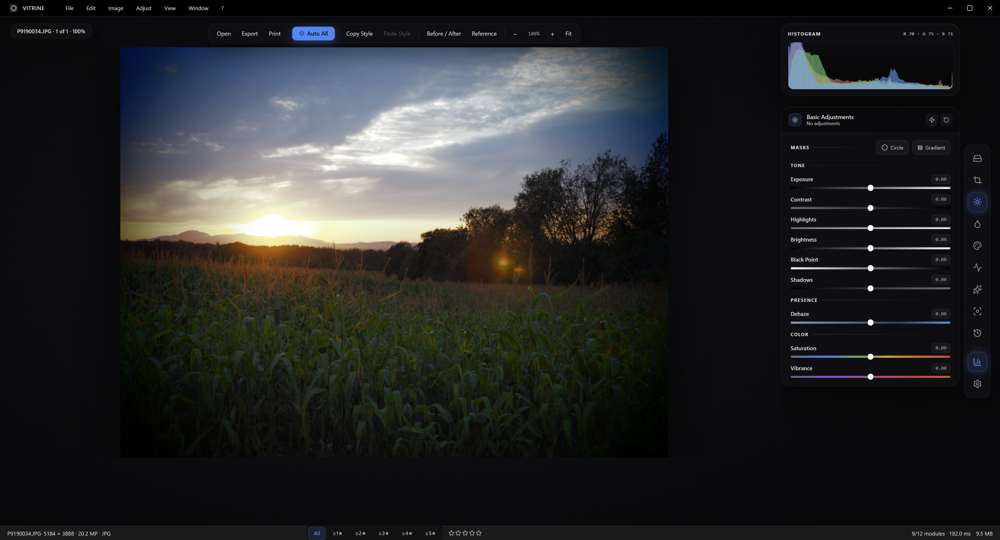
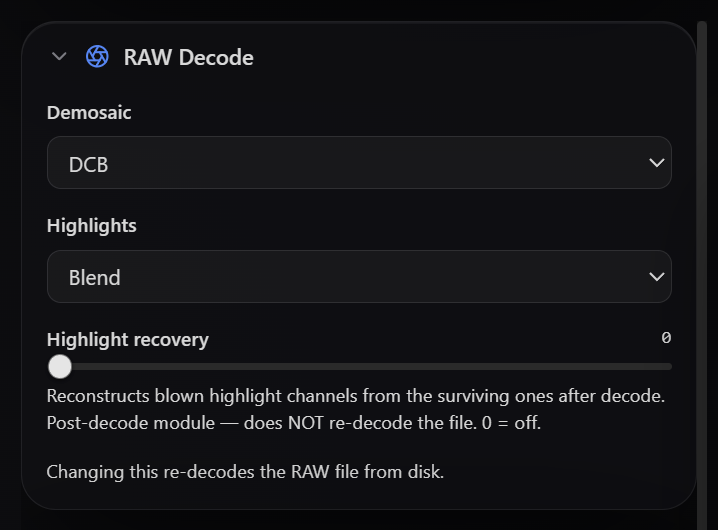
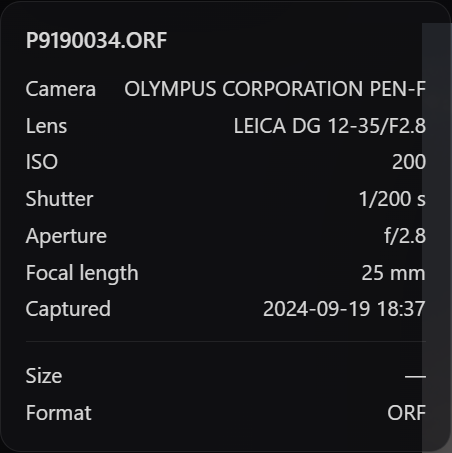
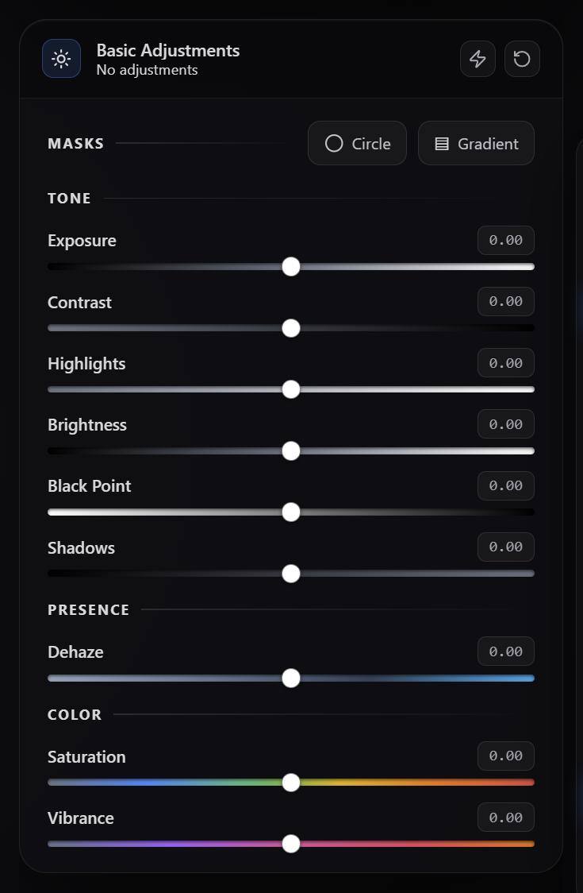
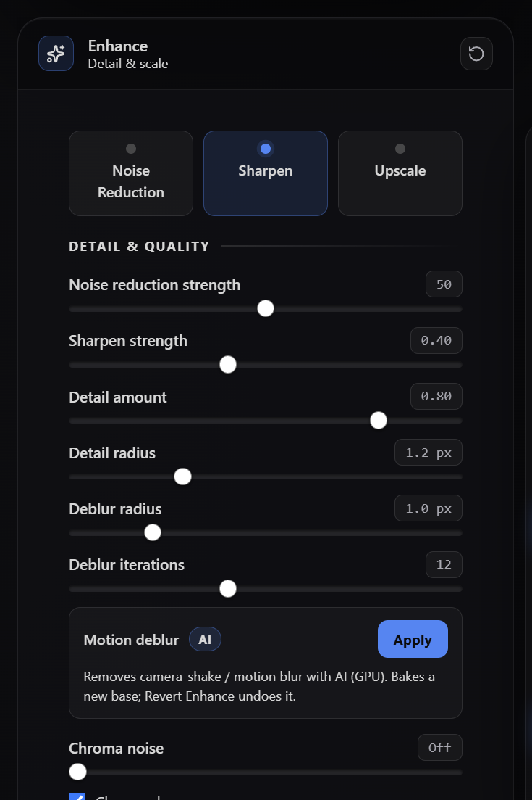
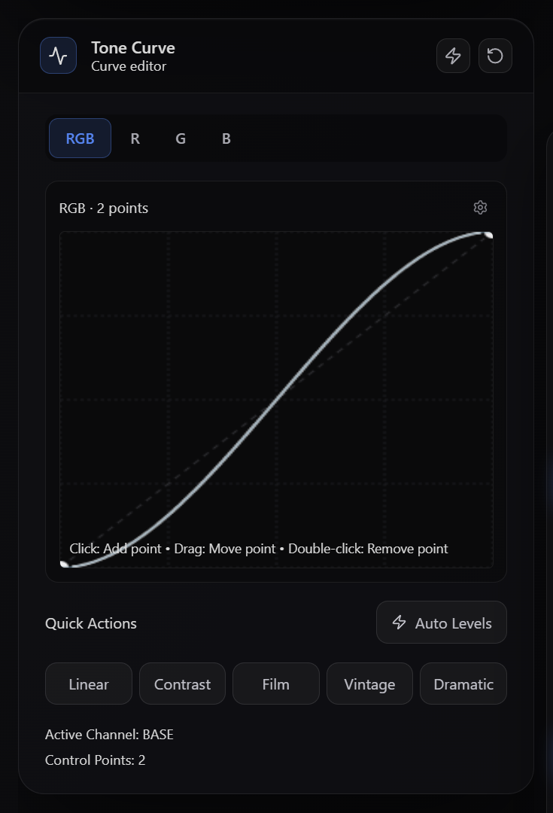
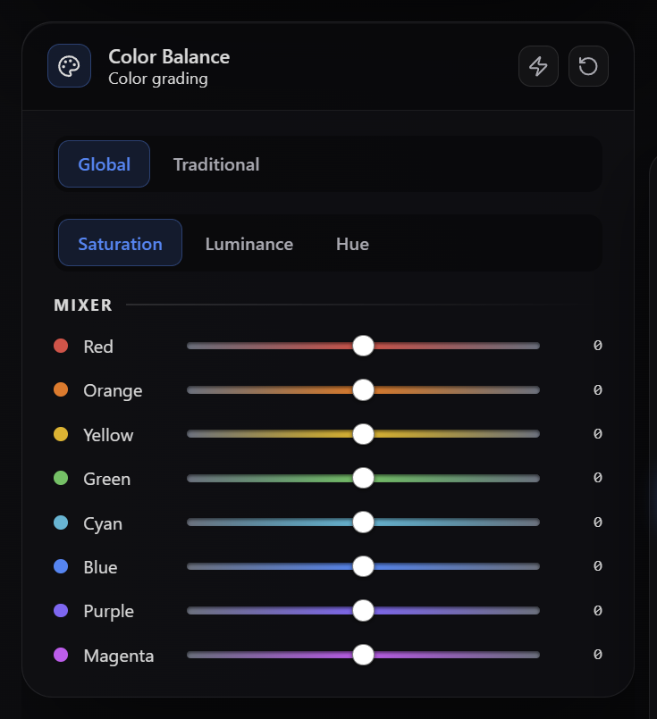
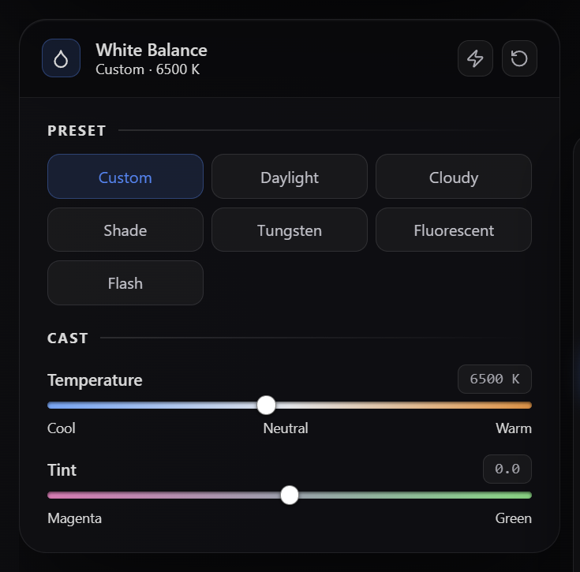
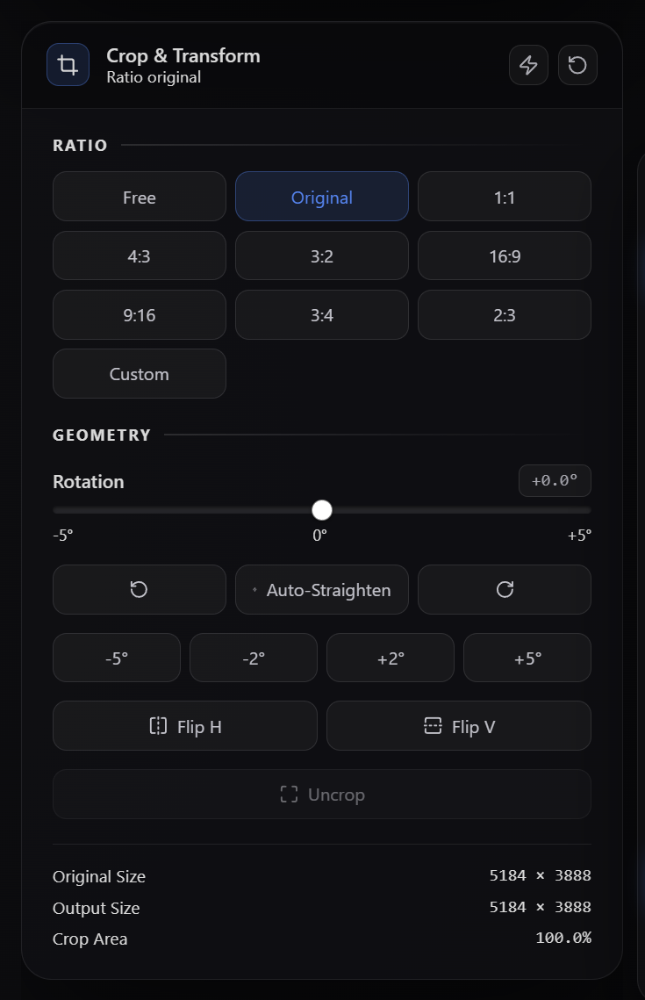
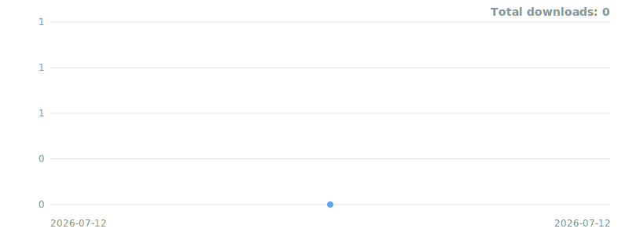

# Vitrine

[](https://github.com/Redrum624/Vitrine/releases)
[](https://github.com/Redrum624/Vitrine/releases/latest)




> **Vitrine** — *the darkroom, behind glass.*

**Vitrine is a free RAW photo editor for Windows.** Open a photo straight off your
camera — Olympus, Canon, Nikon, Sony, Panasonic, or Adobe DNG — and develop it
non-destructively: exposure and colour, tone curves, local masks, lens fixes, AI
denoise and upscaling, then export in the format and colour space you need. Every
edit is saved per photo and re-applied when you reopen it; your original file is
never touched.

It's a lightweight, no-subscription alternative to Lightroom and darktable, with a
clean full-screen **glass workspace** that keeps every tool one click away.

### Why Vitrine

- 📷 **Real RAW** — native LibRaw decoding for 15+ camera formats (CR2/CR3, NEF, ARW, ORF, DNG, RW2, PEF…), with per-photo demosaic and highlight-recovery control.
- ⚡ **Fast** — a GPU pipeline develops your edits in real time; RAW files open in ~0.5 s (embedded preview) while the full 16-bit decode swaps in behind the scenes.
- ✨ **AI where it counts** — Real-ESRGAN ×2/×4 super-resolution and NAFNet motion-deblur run on your GPU, alongside classic denoise, sharpen, and dehaze.
- 🎨 **Truly non-destructive** — adjustments are stored per image and replayed on reopen; the source file is never modified.
- 🆓 **Free, no account** — download the installer and start editing. No sign-up, no subscription.

## Installation

### Download (recommended)

**Just want to use Vitrine?** Download the latest **`Vitrine Setup X.Y.Z.exe`** from the
[**Releases**](https://github.com/Redrum624/Vitrine/releases) page and run it — no other
software required. The installer adds a desktop shortcut and a Start Menu entry.

**Prefer not to install anything?** Grab **`Vitrine X.Y.Z portable.exe`** instead — a single
executable that runs from anywhere (Downloads folder, USB stick) with no installation and no
admin rights, and shares the same profile as the installed app. Since both downloads are
currently unsigned, Windows SmartScreen may show an "unknown publisher" prompt the first time
you run them — choose *More info → Run anyway*. You can verify any download first against
**`SHA256SUMS.txt`** (published with every release):

```powershell
CertUtil -hashfile "Vitrine Setup X.Y.Z.exe" SHA256   # compare with SHA256SUMS.txt
```

- **Windows 10 or 11** (64-bit)
- 8 GB RAM minimum · 16 GB+ recommended for large RAW files

### Build from source

For development, or to build your own installer. Requires **Node.js 18+** (the repo uses
**pnpm**; npm also works). Windows is the supported target.

```bash
git clone https://github.com/Redrum624/Vitrine.git
cd Vitrine
pnpm install            # or: npm install
pnpm run electron-dev   # Vite dev server + Electron (opens automatically on port 3005)
```

Build a distributable Windows installer:

```bash
npm run build:win       # clean -> tsc + vite build -> NSIS installer + portable exe -> collect into installer/
# Output: installer/Vitrine Setup 1.25.0.exe + Vitrine 1.25.0 portable.exe
#         (+ SHA256SUMS.txt, README.txt, LICENSE, THIRD-PARTY-LICENSES.md)
npm run build:win:dir   # fast unpacked build (no installer, quick iteration)
```

The user-facing distributables are collected into a clean **`installer/`** folder at the repo root:
the versioned `Setup …​.exe` and `… portable.exe`, their `SHA256SUMS.txt`, a plain-text
`README.txt`, `LICENSE`, and `THIRD-PARTY-LICENSES.md`. electron-builder's full staging output
(unpacked app, block maps) stays in `release/`.

## A closer look

**One RAW file, developed non-destructively** — straight off the camera on the left, finished on the right.


**Colors that match your camera.** By default, Vitrine fits each RAW's develop to the camera's own embedded render at decode time — so what you see on open is what the camera meant, not a generic bright decode. Measured against OM Workspace (which uses the in-camera engine) on real ORFs: ΔE76 of 1.2–4.7, where Workspace's own difference to the camera JPEG is ~0.8–1.1. Methodology: default settings on both sides, sRGB exports, untouched files; the only known drift is deep-shadow foliage in backlit scenes (the camera's local tone mapping is position-dependent; a color transform is not). Toggle per photo in the RAW Decode panel — off gives Vitrine's neutral bright starting point.


**RAW, handled properly.** Choose the demosaic algorithm and highlight-recovery mode per photo, and read camera/lens details straight from the RAW container.

| RAW Decode (per-photo) | Camera & lens, from the RAW |
|:--:|:--:|
|  |  |

**Every tool in one consistent card system** — a floating glass workspace where each module reads the same.

| | |
|:--:|:--:|
|  |  |
| **Basic Adjustments** — exposure, tone & colour, with mask tools | **Enhance** — AI denoise, sharpen, upscale & motion-deblur |
|  |  |
| **Tone Curve** — master + per-channel RGB | **Color Balance** — 8-channel HSL grading |
|  |  |
| **White Balance** — temp/tint + auto-neutral | **Crop & Transform** — ratios, rotate, auto-straighten |

## Modules

- **File Explorer** — browse and open photos from the local filesystem.
- **Crop & Transform** — aspect ratios, free rotation, auto-straighten (horizon detection), and flip; the crop overlay is live while the module is open, applies on handle release, and re-cropping brings the full frame back with the rect at its last position.
- **Basic Adjustments** — exposure, contrast, highlights, brightness, black point, shadows, dehaze, saturation, and vibrance; Highlights/Shadows recovery is integrated here.
- **Local Adjustments** — radial (circle/oval) and one-sided graduated-filter masks drawn on the canvas, each with its own Basic Adjustments sliders and feather control; managed from the Basic Adjustments panel.
- **White Balance** — temperature and tint sliders with one-click median gray-world auto-neutralisation.
- **Color Balance** — per-channel hue shifts in shadows, midtones, and highlights.
- **Tone Curve** — master and per-channel RGB curves with auto-levels.
- **Enhance** — Noise Reduction (GPU Non-Local-Means), Sharpening (FidelityFX CAS + Richardson–Lucy deblur with adjustable detail radius), AI motion deblur (NAFNet on GPU, opt-in), edge-aware chroma noise reduction, and ×2/×4 upscale (AI super-resolution on GPU, else Lanczos) in a single panel — the whole deterministic chain runs as WebGL2 passes (~30× faster applies); one **Apply Enhance** button drives them all, with a "re-apply to update" hint when upstream edits go stale.
- **Lens Corrections** — Distortion, Vignetting, Chromatic Aberration, creative Blur, and Film Grain in sectioned groups within one card.
- **History** — per-image checkpoint timeline; click any checkpoint to restore that state; persists across sessions separately from Ctrl+Z undo.
- **Histogram** — live RGB and luminosity tone-distribution display in its own floating card.
- **Gallery** — a library grid view of the open folder with selection, per-tile ratings, rating filter, double-click-to-edit, Del-to-remove (drop from the session or move to the Recycle Bin, always confirmed), and a right-click context menu (Open, Remove…, Show in Explorer); opened from the filmstrip dock.
- **Settings** — application preferences, theme, and workspace configuration.

## Features

- **RAW processing** — native LibRaw (`dcraw_emu`) Bayer demosaic in the Electron main process for 15+ formats (CR2/CR3, NEF, ARW, ORF, DNG, RW2, PEF, …), decoding with DCB demosaic + blended highlight reconstruction by default; `libraw-wasm` and embedded-JPEG fallbacks ensure every RAW opens.
- **Camera match (default)** — each RAW is fitted at decode time to its own embedded camera JPEG, so the opening render matches the out-of-camera look (picture mode and gradation included) instead of a generic decode; per-photo toggle in the RAW Decode panel, works with any brand that embeds a preview.
- **Per-image RAW decode control** — a "RAW Decode" panel (shown only for RAW files) lets you choose the demosaic algorithm (AHD/DCB) and highlight-recovery mode (Off/Blend/Reconstruct) per photo (changing either re-decodes from disk), plus a post-decode "Highlight recovery" slider that reconstructs single-channel-clipped highlights; all saved per image and applied on export.
- **Instant RAW preview (progressive open)** — opening a RAW paints the camera's embedded preview in ~0.5 s with your saved edits applied, while the full 16-bit decode develops in the background and swaps in seamlessly ("Developing full quality…" shows in the footer); pixel-precise actions (Auto adjustments, transforms, upscale, print, copy style) wait for full quality automatically.
- **Persistent RAW decode cache** — decoded full-quality bases are kept on disk (up to 2 GB, LRU) keyed by file, decode options, and file modification time, so reopening a RAW in a later session loads full quality in about a second instead of re-decoding; entries invalidate automatically when the source file or decode options change.
- **GPU-accelerated preview** — resident-texture WebGL2 pipeline: image uploaded to the GPU once, all modules run as fragment-shader passes with zero GPU→CPU readback; CPU/Web-Worker fallback runs off the main thread when WebGL2 is unavailable.
- **Preview quality ratchet** — zooming past an image's previous farthest zoom (or applying a crop) automatically re-renders the preview from a higher-resolution source, up to native size, so zoomed and cropped views stay sharp.
- **AI super-resolution upscale** — Real-ESRGAN x4plus (onnxruntime-node + DirectML) runs in the main process for sharper ×2/×4 enlargements when a GPU is available, with tiled bounded-memory inference, live progress, an AI/Standard badge, and automatic fallback to the deterministic Lanczos path.
- **Export** — JPEG, PNG, TIFF, or WebP in 8-bit or 16-bit; sRGB or wide-gamut (Adobe RGB, ProPhoto, Rec.2020) with generated ICC profiles; EXIF/XMP metadata embedded; Enhance output (sharpen/upscale) baked in automatically.
- **Multi-export** — select any number of filmstrip photos (Ctrl/Shift+click) and export them all with one settings pass, each using its own saved edits, into a chosen folder with auto-suffixed filenames.
- **Batch processing** — apply a fixed adjustment preset to a folder of images in one operation.
- **Copy / Paste Style** — transfer a colour grade between images via per-channel RGB histogram matching, expressed as Tone Curve adjustments.
- **Auto adjustments** — one-click *Auto All* (tone, white balance, colour) driven by a learned user-style profile; individual Auto buttons per panel.
- **Before/After compare** — toggle the unedited original against the current edit with synced zoom and pan.
- **Reference image compare** — pin a second photo alongside the current image for side-by-side grading reference.
- **Camera EXIF info** — click the filename chip for a popover with camera make/model, lens, ISO, shutter, aperture, focal length, and capture date; works for RAW files (read natively from the container) and standard formats alike.
- **Star ratings + filtering** — press 1–5 to rate the open image (0 clears); rating written to the file as `xmp:Rating`; a shared rating filter (footer + Gallery) hides lower-rated photos everywhere at once.
- **Filmstrip dock** — a floating, scrollable thumbnail dock aligned under the photo; multi-select with Ctrl/Shift+click; mouse-wheel horizontal scroll; prev/next chevrons and a Gallery shortcut.
- **Glass workspace UI** — full-bleed canvas with floating glass chrome: toolbar pill with responsive overflow menu, icon rail, histogram + module cards, filename chip, and entrance animations that honor reduced-motion preferences.
- **Presets** — save and apply named adjustment snapshots across images, including Local Adjustments mask layers, tone curves, color balance, and highlight recovery.
- **Watermarking** — add text or image watermarks baked into exports.
- **Web-gallery generation** — export a self-contained browsable HTML gallery from selected photos.
- **Print soft-proofing** — simulate paper-and-ink colour output before printing.
- **Per-image edit persistence** — every adjustment is saved per photo and restored automatically the next time the image is opened, across sessions and app updates.
- **Output collections** — group processed images into named output sets for organised delivery.
- **Keyboard shortcuts** — full shortcut coverage for common operations; a help dialog lists all bindings.

## Architecture

### Technology stack
- **Desktop**: Electron 43
- **Frontend**: React 19 + TypeScript 5.9 + Vite 7 + Zustand 5
- **Styling**: Tailwind CSS 4
- **Processing**: resident-texture WebGL2 GPU pipeline (zero-readback, presents to
  canvas) with a CPU fallback that runs in a Web Worker; native LibRaw (`dcraw_emu`) and
  `libraw-wasm` for RAW; **sharp** for export resize + encode/ICC/metadata;
  **onnxruntime-node** + DirectML for AI super-resolution (Real-ESRGAN x4plus) in the main process
- **Build**: Vite + `tsc` + ESLint; packaging via electron-builder

### Core services
```
ImageProcessingPipeline   // module orchestration
rawDecoder.cjs            // main-process RAW demosaic (native -> wasm -> embedded JPEG)
imageWriter.cjs           // export encode (8/16-bit, ICC, EXIF/XMP) via sharp
ExportService             // format/quality/colour-space + wide-gamut conversion
StyleAnalysisService      // Copy/Paste Style (histogram matching)
AutoAdjustService         // Auto All driven by a user-style profile
LocalAdjustmentsModule    // radial/linear masks + per-mask adjustments
```

## Development

```bash
npm run dev          # dev server (vite) + Electron via scripts/dev.cjs
npm run build        # tsc + vite build
npm run typecheck    # tsc --noEmit
npm run lint         # eslint (0 problems)
npm run test         # jest (1834 tests)
npm run test:e2e     # Playwright end-to-end tests
```

## Documentation

- **[CHANGELOG.md](CHANGELOG.md)** — release notes
- **[docs/USER_GUIDE.md](docs/USER_GUIDE.md)** — using the app
- **[docs/TECHNICAL_ARCHITECTURE.md](docs/TECHNICAL_ARCHITECTURE.md)** — system design
- **[docs/RAW_PROCESSING.md](docs/RAW_PROCESSING.md)** — LibRaw integration
- **[docs/DEVELOPMENT_GUIDE.md](docs/DEVELOPMENT_GUIDE.md)** — contributing

## Contributing

1. Create a feature branch (`git checkout -b feat/your-feature`)
2. Make changes with proper TypeScript types
3. Keep `npm run typecheck`, `npm run lint`, and `npm run test` green
4. Commit with conventional commits and open a Pull Request

## Downloads over time



*Sampled daily from the GitHub Releases API — the curve builds from launch day forward.*

## License

**Source-available, non-commercial.** Vitrine is licensed under the
[PolyForm Noncommercial License 1.0.0](LICENSE) — free to use, modify, and share for
non-commercial purposes. Commercial use of this project or its derivatives is not permitted.
This is **not** an OSI-approved open-source license.

Bundled third-party components (npm packages, LibRaw, libvips, Electron/Chromium) retain their
own licenses and are unaffected by the project license. See [THIRD-PARTY-LICENSES.md](THIRD-PARTY-LICENSES.md)
for the full attribution list and per-license obligations.

## Acknowledgments

- **LibRaw** — RAW decoding · **sharp / libvips** — image encode & colour management
- **Electron**, **React**, **Vite**, **Tailwind CSS**

---

**Vitrine** — a free RAW photo editor for Windows.
