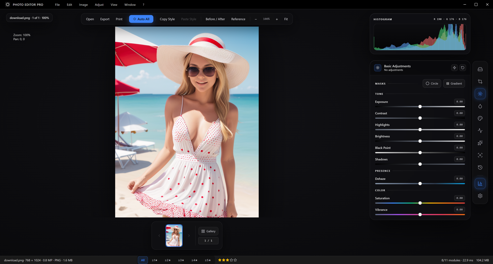

# Photo Editor Pro




A **desktop RAW photo editor** built with Electron + React, featuring a WebGL2/CPU
processing pipeline, native LibRaw demosaicing, colour-managed export, and
non-destructive local adjustments.

*A free, non-destructive RAW photo editor for Windows — a lightweight alternative to Lightroom and darktable for Olympus ORF, Canon CR2/CR3, Nikon NEF, Sony ARW, and Adobe DNG files.*

## Installation

### Prerequisites
- Node.js 18+ and a package manager (the repo is set up for **pnpm**; npm also works)
- Windows, macOS, or Linux · 8 GB+ RAM (16 GB+ recommended for large RAW files)

### Option A — Prebuilt installer (Windows)

Download the latest `Photo Editor Pro Setup X.Y.Z.exe` from the
[Releases](https://github.com/Redrum624/photo_app/releases) page and run it.
The installer creates a desktop shortcut and Start Menu entry; no extra
dependencies are needed.

### Option B — Install & run from source (development)

```bash
git clone https://github.com/Redrum624/photo_app.git
cd photo_app
pnpm install            # or: npm install
pnpm run electron-dev   # Vite dev server + Electron
```

The app opens automatically once the Vite dev server is ready (port 3005).

### Option C — Build a Windows release from source

```bash
npm run build:win       # clean -> tsc + vite build -> NSIS installer -> collect into installer/
# Output: installer/Photo Editor Pro Setup 1.11.0.exe (+ README.txt, LICENSE, THIRD-PARTY-LICENSES.md)
npm run build:win:dir   # fast unpacked build (no installer, quick iteration)
npm run dist            # electron-builder for the current platform
```

The user-facing distributables are collected into a clean **`installer/`** folder at the repo root:
the versioned `Setup …​.exe`, a plain-text `README.txt`, `LICENSE`, and `THIRD-PARTY-LICENSES.md`.
electron-builder's full staging output (unpacked app, block maps) stays in `release/`.

## Modules

- **File Explorer** — browse and open photos from the local filesystem.
- **Crop & Transform** — aspect ratios, free rotation, auto-straighten (horizon detection), and flip.
- **Basic Adjustments** — exposure, contrast, highlights, brightness, black point, shadows, dehaze, saturation, and vibrance; Highlights/Shadows recovery is integrated here.
- **Local Adjustments** — radial (circle/oval) and one-sided graduated-filter masks drawn on the canvas, each with its own Basic Adjustments sliders and feather control; managed from the Basic Adjustments panel.
- **White Balance** — temperature and tint sliders with one-click median gray-world auto-neutralisation.
- **Color Balance** — per-channel hue shifts in shadows, midtones, and highlights.
- **Tone Curve** — master and per-channel RGB curves with auto-levels.
- **Enhance** — Noise Reduction (GPU Non-Local-Means), Sharpening (FidelityFX CAS + Richardson–Lucy deblur), and ×2/×4 upscale (AI super-resolution on GPU, else Lanczos) in a single panel; one **Apply Enhance** button drives all three.
- **Lens Corrections** — Distortion, Vignetting, Chromatic Aberration, creative Blur, and Film Grain in collapsible accordion sections.
- **History** — per-image checkpoint timeline; click any checkpoint to restore that state; persists across sessions separately from Ctrl+Z undo.
- **Histogram** — live RGB and luminosity tone-distribution display.
- **Settings** — application preferences, theme, and workspace configuration.

## Features

- **RAW processing** — native LibRaw (`dcraw_emu`) Bayer demosaic in the Electron main process for 15+ formats (CR2/CR3, NEF, ARW, ORF, DNG, RW2, PEF, …), decoding with DCB demosaic + blended highlight reconstruction by default; `libraw-wasm` and embedded-JPEG fallbacks ensure every RAW opens.
- **GPU-accelerated preview** — resident-texture WebGL2 pipeline: image uploaded to the GPU once, all modules run as fragment-shader passes with zero GPU→CPU readback; CPU/Web-Worker fallback runs off the main thread when WebGL2 is unavailable.
- **AI super-resolution upscale** — Real-ESRGAN x4plus (onnxruntime-node + DirectML) runs in the main process for sharper ×2/×4 enlargements when a GPU is available, with tiled bounded-memory inference, live progress, an AI/Standard badge, and automatic fallback to the deterministic Lanczos path.
- **Export** — JPEG, PNG, TIFF, or WebP in 8-bit or 16-bit; sRGB or wide-gamut (Adobe RGB, ProPhoto, Rec.2020) with generated ICC profiles; EXIF/XMP metadata embedded; Enhance output (sharpen/upscale) baked in automatically.
- **Multi-export** — select any number of filmstrip photos (Ctrl/Shift+click) and export them all with one settings pass, each using its own saved edits, into a chosen folder with auto-suffixed filenames.
- **Batch processing** — apply a fixed adjustment preset to a folder of images in one operation.
- **Copy / Paste Style** — transfer a colour grade between images via per-channel RGB histogram matching, expressed as Tone Curve adjustments.
- **Auto adjustments** — one-click *Auto All* (tone, white balance, colour) driven by a learned user-style profile; individual Auto buttons per panel.
- **Before/After compare** — toggle the unedited original against the current edit with synced zoom and pan.
- **Reference image compare** — pin a second photo alongside the current image for side-by-side grading reference.
- **Star ratings + filtering** — press 1–5 to rate the open image (0 clears); rating written to the file as `xmp:Rating`; filter the filmstrip by minimum rating.
- **Filmstrip** — scrollable, collapsible thumbnail strip; multi-select with Ctrl/Shift+click; mouse-wheel horizontal scroll.
- **Presets** — save and apply named adjustment snapshots across images.
- **Watermarking** — add text or image watermarks baked into exports.
- **Web-gallery generation** — export a self-contained browsable HTML gallery from selected photos.
- **Print soft-proofing** — simulate paper-and-ink colour output before printing.
- **Per-image edit persistence** — every adjustment is saved per photo and restored automatically the next time the image is opened, across sessions and app updates.
- **Output collections** — group processed images into named output sets for organised delivery.
- **Keyboard shortcuts** — full shortcut coverage for common operations; a help dialog lists all bindings.

## Architecture

### Technology stack
- **Desktop**: Electron 39
- **Frontend**: React 19 + TypeScript 5.9 + Vite 7 + Zustand 5
- **Styling**: Tailwind CSS 4
- **Processing**: resident-texture WebGL2 GPU pipeline (zero-readback, presents to
  canvas) with a CPU fallback that runs in a Web Worker; native LibRaw (`dcraw_emu`) and
  `libraw-wasm` for RAW; **sharp** for export resize + encode/ICC/metadata;
  **onnxruntime-node** + DirectML for AI super-resolution (Real-ESRGAN x4plus) in the main process
- **Build**: Vite + `tsc` + ESLint; packaging via electron-builder

### Core services
```
ImageProcessingPipeline   // module orchestration
rawDecoder.cjs            // main-process RAW demosaic (native -> wasm -> embedded JPEG)
imageWriter.cjs           // export encode (8/16-bit, ICC, EXIF/XMP) via sharp
ExportService             // format/quality/colour-space + wide-gamut conversion
StyleAnalysisService      // Copy/Paste Style (histogram matching)
AutoAdjustService         // Auto All driven by a user-style profile
LocalAdjustmentsModule    // radial/linear masks + per-mask adjustments
```

## Development

```bash
npm run dev          # dev server (vite) + Electron via scripts/dev.cjs
npm run build        # tsc + vite build
npm run typecheck    # tsc --noEmit
npm run lint         # eslint (0 problems)
npm run test         # jest (1087 tests)
npm run test:e2e     # Playwright end-to-end tests
```

## Documentation

- **[CHANGELOG.md](CHANGELOG.md)** — release notes
- **[docs/USER_GUIDE.md](docs/USER_GUIDE.md)** — using the app
- **[docs/TECHNICAL_ARCHITECTURE.md](docs/TECHNICAL_ARCHITECTURE.md)** — system design
- **[docs/RAW_PROCESSING.md](docs/RAW_PROCESSING.md)** — LibRaw integration
- **[docs/DEVELOPMENT_GUIDE.md](docs/DEVELOPMENT_GUIDE.md)** — contributing

## Contributing

1. Create a feature branch (`git checkout -b feat/your-feature`)
2. Make changes with proper TypeScript types
3. Keep `npm run typecheck`, `npm run lint`, and `npm run test` green
4. Commit with conventional commits and open a Pull Request

## License

**Source-available, non-commercial.** Photo Editor Pro is licensed under the
[PolyForm Noncommercial License 1.0.0](LICENSE) — free to use, modify, and share for
non-commercial purposes. Commercial use of this project or its derivatives is not permitted.
This is **not** an OSI-approved open-source license.

Bundled third-party components (npm packages, LibRaw, libvips, Electron/Chromium) retain their
own licenses and are unaffected by the project license. See [THIRD-PARTY-LICENSES.md](THIRD-PARTY-LICENSES.md)
for the full attribution list and per-license obligations.

## Acknowledgments

- **LibRaw** — RAW decoding · **sharp / libvips** — image encode & colour management
- **Electron**, **React**, **Vite**, **Tailwind CSS**

---

**Photo Editor Pro** — a free RAW photo editor for Windows.
