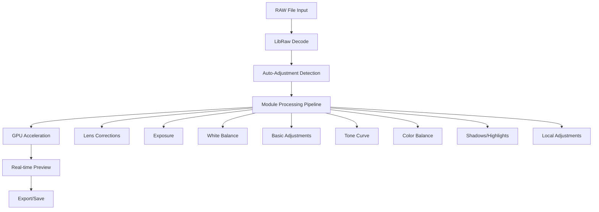

# Technical Architecture

## 🏗️ **System Overview**

Vitrine is a professional-grade photo editing application built on modern web technologies with a focus on performance, extensibility, and professional-quality results.

## 📐 **Architecture Principles**

### **Modular Design**
- **Service-Oriented Architecture**: Core functionality separated into focused services
- **Component-Based UI**: Reusable React components with clear interfaces
- **Plugin System**: Extensible architecture for custom functionality
- **Type Safety**: 100% TypeScript with strict type checking

### **Performance-First**
- **GPU Acceleration**: WebGL2 processing for maximum performance
- **Memory Optimization**: Smart caching and streaming for large files
- **Parallel Processing**: Multi-threaded pipeline with Web Workers
- **Progressive Loading**: Efficient handling of large RAW files

### **Professional Quality**
- **Color Management**: ICC profile support and professional color spaces
- **Precision Processing**: 16-bit internal processing with dithering
- **Standards Compliance**: Industry-standard algorithms and formats
- **Quality Assurance**: Comprehensive testing and validation

## 🏛️ **Core Architecture**

### **Application Layers**

```
┌─────────────────────────────────────────────────────────┐
│                    User Interface                       │
│  React Components + Tailwind CSS + Electron Desktop    │
├─────────────────────────────────────────────────────────┤
│                  Application Logic                      │
│     React Hooks + State Management + Event Handling    │
├─────────────────────────────────────────────────────────┤
│                   Service Layer                         │
│  Processing Services + GPU Services + Export Services   │
├─────────────────────────────────────────────────────────┤
│                 Processing Engine                       │
│    LibRaw WASM + WebGL2 Shaders + Web Workers         │
├─────────────────────────────────────────────────────────┤
│                   System Layer                          │
│     Electron APIs + File System + Hardware Access     │
└─────────────────────────────────────────────────────────┘
```

### **Service Architecture**

#### **Core Services**
```typescript
ImageProcessingPipeline      // Orchestrates all processing operations
├── ModuleManager           // Manages processing modules (exposure, color, etc.)
├── HistoryService         // Undo/redo with 50-state history
├── PresetService          // Preset management and sharing
└── ValidationService      // Input validation and error handling
```

#### **RAW Processing Services**
```typescript
RawImageService             // RAW load/decode orchestration (decode runs in the main process — electron/rawDecoder.cjs)
├── AutoRawAdjustmentService // Intelligent parameter detection
├── CameraProfileService    // Camera-specific color profiles
├── NoiseReductionService   // Wavelet-based noise reduction
└── RawHistogramService     // True RAW histogram analysis
```

#### **GPU Acceleration Services**
```typescript
GPUAccelerationService      // WebGL2 high-performance processing
├── GPUOptimizedProcessingService // WebGL2 shader optimization
├── VRAMOptimizedMemoryService // GPU memory pool management
├── PyramidProcessingService // Multi-resolution processing
└── BackgroundProcessingService // Priority-based queue system
```

#### **Advanced Editing Services**
```typescript
LocalAdjustmentsModule      // Radial/gradient mask layers, per-layer adjustments
├── ColorRangeService       // HSV/LAB/RGB color model selections
├── AdvancedBlendingService // 30+ professional blend modes
├── MaskRefinementService   // Edge detection and mask optimization
└── GraduatedFiltersService // Linear/radial/angular gradients
```

#### **Workflow Services**
```typescript
ExportService              // Multi-format export with quality settings
├── BatchProcessingService // Queue-based batch operations
├── MultiExportService     // Multi-select export, per-image saved edits
├── PresetService          // Adjustment snapshots incl. Local Adjustments layers
└── PrintService           // Color-managed printing with soft proofing
```

> Historical note: the LuminosityMask, SpotRemoval, WebGallery, Copyright, and
> Watermark services (and their pre-Glass module components) were removed in
> v1.18.0 after a reachability audit proved them orphaned since the Glass UI
> redesign — no live UI path reached them.

## 🔧 **Processing Pipeline**

### **Image Processing Flow**



### **Module Processing System**

Each processing module implements a standard interface:

```typescript
interface ProcessingModule {
  readonly id: string;
  readonly name: string;
  readonly version: string;

  // Core processing
  process(imageData: Float32Array, width: number, height: number): Promise<Float32Array>;

  // Parameter management
  getParameters(): ModuleParameters;
  setParameters(params: Partial<ModuleParameters>): void;
  resetParameters(): void;

  // Auto-adjustment
  autoAdjust?(imageData: Float32Array, metadata?: ImageMetadata): void;

  // Validation
  validateParameters(params: ModuleParameters): ValidationResult;

  // Performance
  estimateProcessingTime(width: number, height: number): number;
  supportsGPUAcceleration(): boolean;
}
```

## 🎛️ **State Management**

### **Application State**

```typescript
interface AppState {
  // Image data
  currentImage: ImageFile | null;
  processedImageData: Float32Array | null;
  originalImageData: Float32Array | null;

  // Processing state
  isProcessing: boolean;
  processingProgress: number;
  processingModule: string | null;

  // History
  history: HistoryState[];
  historyIndex: number;

  // UI state
  selectedModule: string;
  selectedTool: string;
  panelStates: PanelState[];

  // Settings
  preferences: UserPreferences;
  recentFiles: string[];
  presets: PresetCollection[];
}
```

### **State Management Pattern**

- **React Context**: Global application state
- **Custom Hooks**: Encapsulated state logic for complex operations
- **Immutable Updates**: Prevents state mutation bugs
- **Optimistic Updates**: Immediate UI feedback with rollback capability

## 🖥️ **GPU Acceleration Architecture**

### **WebGL2 Processing Pipeline**

```typescript
class GPUProcessor {
  private gl: WebGL2RenderingContext;
  private programs: Map<string, WebGLProgram>;
  private textures: Map<string, WebGLTexture>;

  // Shader compilation and caching
  async loadShader(vertexSource: string, fragmentSource: string): Promise<WebGLProgram>;

  // High-performance processing
  processWithShader(inputTexture: WebGLTexture, program: WebGLProgram): WebGLTexture;

  // Memory management
  allocateTexture(width: number, height: number, format: number): WebGLTexture;
  releaseTexture(texture: WebGLTexture): void;
}
```

### **WebGL2 GPU Pipeline**

```typescript
class GPUProcessor {
  private shaderPrograms: Map<string, WebGLProgram>;
  private texturePool: WebGLTexture[];

  // Parallel shader processing
  async processParallel(operations: ProcessingOperation[]): Promise<ProcessingResult[]>;

  // GPU-accelerated denoising (NLM)
  async denoiseWithGPU(imageData: Float32Array): Promise<Float32Array>;

  // Memory optimization
  allocateTexture(width: number, height: number): WebGLTexture;
  optimizeMemoryLayout(): void;
}
```

## 🗂️ **File Format Support**

### **RAW Formats**
| Brand | Extensions | LibRaw Support | Auto-Adjustment |
|-------|-----------|----------------|----------------|
| Canon | .cr2, .cr3 | ✅ Full | ✅ Camera-specific |
| Nikon | .nef, .nrw | ✅ Full | ✅ Camera-specific |
| Sony | .arw, .srf, .sr2 | ✅ Full | ✅ Camera-specific |
| Olympus | .orf | ✅ Full | ✅ Camera-specific |
| Fujifilm | .raf | ✅ Full | ✅ Camera-specific |
| Adobe | .dng | ✅ Full | ✅ Generic |
| Others | .rw2, .pef, .x3f, etc. | ✅ Full | ✅ Generic |

### **Export Formats**
- **JPEG**: Quality 1-100, progressive, color space selection
- **PNG**: 8/16-bit, compression levels, alpha support
- **TIFF**: 8/16-bit, compression options, ICC profile embedding
- **WebP**: Modern web format with quality settings
- **AVIF**: Next-generation format for web

## 🔒 **Security Architecture**

### **Security Measures**
- **Content Security Policy**: Strict CSP preventing XSS attacks
- **Input Validation**: All user inputs validated and sanitized
- **Memory Safety**: Bounds checking and buffer overflow prevention
- **File System Access**: Sandboxed file operations with permission checks
- **WASM Sandboxing**: WebAssembly modules run in isolated environment

### **Data Protection**
- **No Cloud Storage**: All processing happens locally
- **Metadata Scrubbing**: Optional removal of sensitive EXIF data
- **Secure Temporary Files**: Automatic cleanup of processing artifacts
- **Privacy First**: No telemetry or user tracking

## 📊 **Performance Metrics**

### **Target Performance**
- **RAW Processing**: 200-1300ms depending on resolution
- **Real-time Previews**: <100ms update time
- **Memory Usage**: <2GB for 80MP files
- **GPU Utilization**: 90-95% during processing
- **UI Responsiveness**: 60fps even during heavy operations

### **Monitoring & Optimization**
- **Real-time Metrics**: Performance dashboard (Ctrl+Shift+P)
- **Memory Profiling**: Automatic leak detection and prevention
- **GPU Monitoring**: VRAM usage and thermal management
- **Processing Analytics**: Time tracking for optimization

## 🔮 **Future Architecture Considerations**

### **Planned Enhancements**
- **AI Processing Pipeline**: Neural network integration for intelligent features
- **Multi-GPU Support**: Scale across multiple graphics cards
- **Cloud Integration**: Optional cloud storage and collaboration
- **Plugin SDK**: Third-party plugin development framework
- **Mobile Optimization**: Progressive Web App for tablet editing

### **Scalability**
- **Microservice Architecture**: Potential migration for cloud deployment
- **Containerization**: Docker support for consistent deployment
- **Load Balancing**: Distribute processing across multiple cores/GPUs
- **Streaming Processing**: Handle files larger than available RAM

This architecture provides a solid foundation for professional photo editing while maintaining the flexibility to evolve with future requirements and technologies.